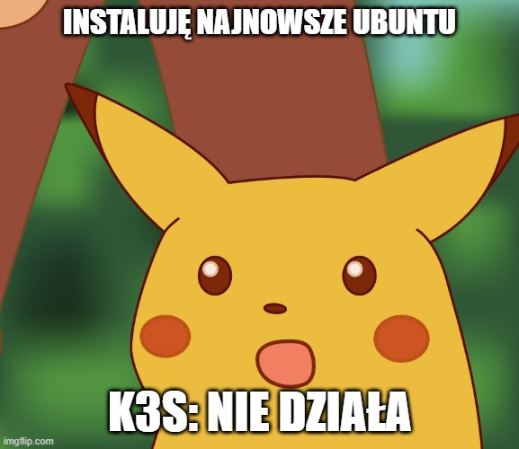
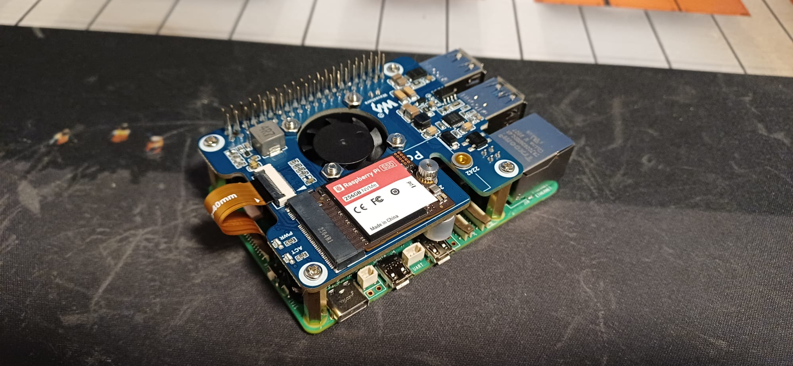
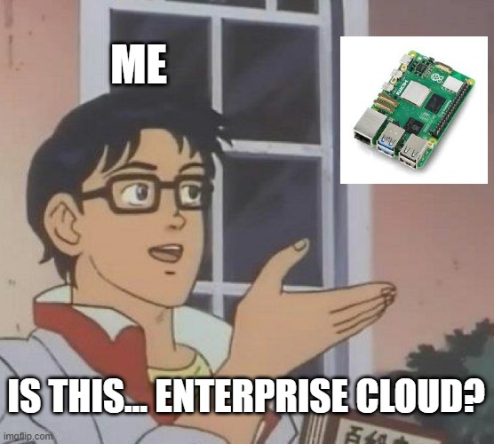
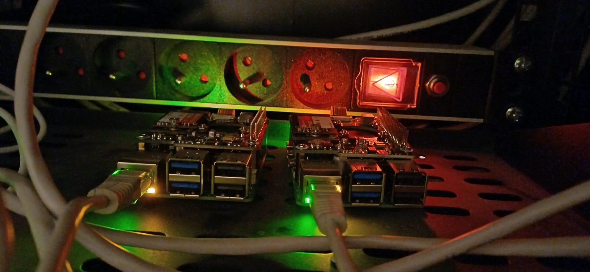

Kiedyś trzeba zacząć stawiać to środowisko. W międzyczasie walczę z wersją v0.3 [homeassistant-operator](https://github.com/przemekhys/homeassistant-operator) — już jestem na finiszu testów e2e, ale znalazłem poważne bugi i trochę mi zejdzie, zanim je naprawię. Uświadamia mi to, że najwięcej problemów z tym oprogramowaniem znajdę, używając go na co dzień. Patrząc po postępach, za ok. 3 miesiące będę mógł uruchomić działającą wersję i próbować migracji do nowego Home Assistant, ale do tego potrzebny jest działający Kubernetes. Czekam w międzyczasie na płytkę, która ma umożliwić zasilanie przez PoE — Malina leży mi na biurku i mnie woła.

## Instalacja na skróty, problemy na pełnej

Czemu nie — przyda mi się trochę rozrywki w starym stylu. Jak przyjedzie rozszerzenie PoE, przełożę tylko dysk i powinno działać. Instaluję system operacyjny — co tu wybrać? Może Ubuntu, bez wymyślania. Odruchowo sięgam zazwyczaj po Arch Linuxa, ale nie widziałem, by ktoś używał go na Raspberry Pi 5; bez społeczności nie ma wsparcia — zabawa na dłużej, a ja mam może ze dwie godziny wolnego. Ubuntu jest sprawdzone, więc ściągam obraz, nagrywam go na dysk SSD, podłączam wszystko i bootuje się. Super — zainstaluję k3s i zobaczymy, jak pójdzie. No i pierwszy zgrzyt — zainstalowałem Ubuntu 25 i k3s nie działa; coś jest nie tak z cgroups domyślnie w tej wersji. Nic to, szybki downgrade do Ubuntu 24 LTS i jedziemy dalej. Instalacja k3s poszła gładko.

## Gdzie trzymać sekrety, żeby nie bolało?

Teraz czas na narzędzia do zarządzania konfiguracją — wybieram FluxCD, bo już go używałem i wiem, że działa dobrze. Nie potrzebuje dużo pamięci, a w tym klastrze będę bił się o każdy megabajt RAM-u. Instalacja poszła gładko, jakby inaczej. Przyda się dużo usług, które ułatwią pracę z K8s, ale podstawą będzie External Secrets, dzięki któremu będę mógł trzymać sekrety poza klastrem i nie tworzyć ich ręcznie w Kubernetes. Miałem tu mały dylemat: gdzie trzymać sekrety. Z jednej strony fajnie byłoby mieć wszystko lokalnie, ale utrzymywanie własnego Vaulta rodzi problem jajka i kury — nie chcę się bawić w dedykowany serwer, na którym miałbym hostować Vault.

## Mała chmura, wielka ulga

Więc chmura publiczna. AWS/Azure/GCP są passé — przerośnięte kolosy z cennikami z kosmosu. Scaleway ma fajną ofertę na małe instancje i datacenter w Polsce, więc tam będę trzymać sekrety. Trochę się napracowałem przy konfiguracji: najpierw Terraform i tworzenie sekretów w Scaleway, potem konfiguracja External Secrets w k3s, a na końcu integracja z FluxCD, żeby wszystko się ładnie domykało i deployowało. SWAG udało się zintegrować w 2 h, więc jestem zadowolony — od czytania dokumentacji do działającego rozwiązania.

## PoE, piny i klasyczna walka o przetrwanie

Następnego dnia rano odwiedził mnie kurier z rozszerzeniem PoE — szybkie podłączenie i... wiedziałem, że nie będzie tak prosto. Próbuję rozmontować Malinę i nie chce wyjść gniazdo żeńskie na piny — nie schodzi tak gładko, jak powinno. Użyłem kombinerek, za dużych do tego zadania, więc piny się lekko pogięły. Klasyka: nożem do masła je wyprostuję; jeśli się urwą — trudno, nie przewiduję ich intensywnego używania. Śrubki dokręcone, pasta położona, radiator przykręcony, podłączam zasilanie PoE i nie bootuje się. Piny — pewnie zwarcie, czy inna plaga egipska. Zasilanie jest, natomiast nie widać dysku. Przyglądam się dokumentacji i widzę, że taśma jest źle włożona; odkręcam wszystko, poprawiam taśmę i... działa. Uff — ale się naszukałem. To definicja klasycznej rozrywki; nie pamiętam, kiedy ostatnio miałem problem z bootowaniem Linuksa! Teraz mogę z dumą wsadzić "raspberry2" obok "raspberry1" w mojej szafce rackowej i cieszyć się porządkiem bez zasilaczy.

