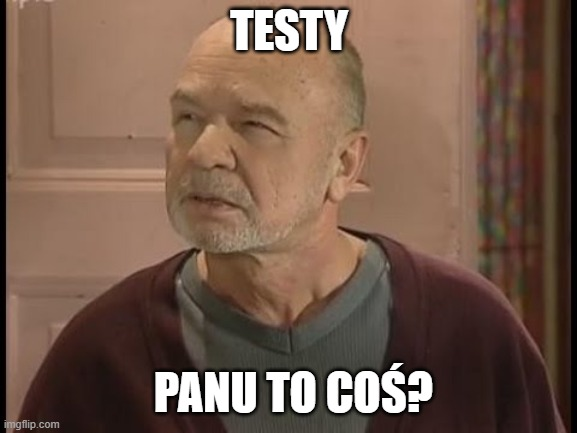

Start zawsze jest prosty i ekscytujący. Wybieramy technologie, frameworki, pierwsze CI - miesiąc miodowy. Szybko doszło do mnie, jak skomplikowany będzie to projekt - właściwie będę implementował [Supervisor](https://github.com/home-assistant/supervisor) tylko na potrzeby k8s :)
Będę potrzebował dużo większej wiedzy, jak faktycznie działa HA niż mam aktualnie, będę też musiał odświeżyć swoją wiedzę dotyczącą API k8s, golanga znam pobieżnie - to kręci mnie tylko bardziej. 

## Jak to miało być proste…

Mam za sobą już 2 release'y, w pierwszym utworzyłem samego controllera oraz pierwszy CRD `HomeAssistant` - controller zarządza instancjami, a każdą z nich orkiestruje `HomeAssistant` easy peasy, bułka z masłem. Tu sam bym doszedł w 1 miesiąc, a z AI zajęło mi to 4h pracy per se, ale cały weekend, bo musiałem sobie robić przerwy pomiędzy sesjami - jestem dusigroszem i mam najmniejsze z możliwych planów agentów AI :) - co nie powiem, ma tą zaletę, że robi się przerwy i ma się czas na inne rzeczy. Z drugim release było trochę ciężej, tu na świeczniku był Zero-Touch Deployment - chciałem mieć możliwość uruchomić instancję HA bez onboardingu, jest to proces, gdzie podajemy login i hasło dla admina, podajemy adres naszego domu, wybieramy język itp., całość klikalna w UI. No nie pasuje mi to wcale do deklaratywnego podejścia, będę też potrzebował w dalszej części działającego HA, żeby przeprowadzić kolejne automatyzacje deploymentów, a nie mogę polegać na przeklikiwaniu UI. Szybka przebieżka przez dokumentację i możemy wykorzystać API HA, aby zrobić to bez klikania, baja. No i tu będzie nam potrzebny `HomeAssistantSecrets`, bo jakoś muszę definiować login i hasło pierwszego użytkownika. Niby sprawa prosta, ale po kilku iteracjach musiałem ręcznie przeglądać k8s, dlaczego niektóre pody nie wstają albo CRD się nie generują, kod wygenerowany wygląda dobrze, ale czasem brakuje tu i ówdzie małych rzeczy, zirytowało mnie to strasznie - nie po to płacę kokosy za AI, żeby mi błędy robił, ale jak nad tym pomyśleć, to dokładnie tak jak z programistami, robią błędy i tyle. Aby je wykrywać potrzebne są testy i tu narodził się plan, sprytny, dlaczego AI nie powinno samo pisać testów, przecież jak kod pisze, to testy tym bardziej, jak testy są potrzebne, to jakie? Ile? Co testować?

## Testy Panie Feerdku, mówi panu to coś?

Oczywiście idę po najmniejszej linii oporu - Agencie AI, przygotuj mi strategię testowania, no bo wiesz, mam tu projekt Golangowy. Magiczne pudełko chwilę myśli i wypluwa rozwiązanie - klasyczna piramida testów. OK, brzmi dobrze, klasyka jak Kevin Sam W Domu w święta, o i wzmianka o pokryciu testów na poziomie 70%. Ambitnie myślę, ale sam tego pisać nie będę, tylko mój magiczny pomocnik, co pracy się nie boi. Więc wydałem rozkaz do roboty, zgodnie z wytycznymi, a ja sobie herbatkę zaparzę. Tokeny się palą aż miło, pokrycie całościowe rośnie, przeboleję teraz, potem będzie łatwiej myślę. Tokeny uciekają z mojego wirtualnego portfela, ale ilość kodu rośnie. Gdy już nie było tokenów, a efektów nie widać, postanowiłem sprawdzić, co moje AI testuje na moją jakże precyzyjną instrukcję "zrób by było dobrze". O matko, 800 linii testów testuje 100 linii kodu produkcyjnego, Test-Driven Development jak nic, pewnie wszystko wytestowane na wskroś. Hmm... ale co to AI testowało, kubernetes będzie tworzył pody, jak usunę istniejące, no będzie, już nawet to testują w innym repozytorium, ale pokrycie testów rośnie. O, testujemy, czy yamle generowane przez framework są poprawnymi yamlami, ładnie, na co przepalam czas. Sprawdzałem też, czy każde pole w CRD jest poprawnie rejestrowane w API k8s i czy ogólnie API k8s działa. Większość testów bez znaczenia, ale odznaka byłaby moja na githubie.

## Co ja mam właściwie testować? Czy AI mi pomoże?

No ale samemu takiej strategii nie przygotuje, bo niby skąd mam to wiedzieć? Wczoraj ja co najwyżej instalowałem operatory przez helm install, a dziś mam je pisać. Użyję więc może wyszuki... AI, aby mi wyszukało materiały na ten temat, podpytam jakiegoś czata, aby mi przygotował linki, to 20 materiałów o testowaniu operatorów i mam przed oczami mnóstwo wartościowego contentu, nawet pobieżna analiza mówi, że błądziłem.

1. **Testuj zachowanie, a nie implementację** – Skup się na tym, co kod robi, a nie jak to robi
2. **Jakość ponad pokryciem** – 50% pokrycia przy użyciu sensownych testów jest lepsze niż 90% pokrycia przy użyciu testów trywialnych
3. **Testuj granice** – Przypadki brzegowe i ścieżki błędów to miejsca, w których ukrywają się błędy
4. **Idempotencja króluje** – Każdy test uzgadniania powinien weryfikować idempotentne zachowanie
5. **Realistyczne scenariusze** – Testy powinny odzwierciedlać rzeczywiste wzorce użytkowania

Oczywiste oczywistości. Zmarnowałem całe popołudnie na generowaniu bezsensownych testów. I cyk, git reset --hard, do śmieci całość. Nie miałem już siły na testy, najpierw spróbuję coś wartościowego zaimplementować i do tego dodam testy.

## E2E: prawda wychodzi na jaw

`HomeAssistantConfiguration` kolejny krok do dotarcia do użytecznego operatora, prosta sprawa, generuje configmapę, podpina do poda, przy okazji nie pozwala samemu tej config mapy zmieniać, wszystko przez CRD. Tu sobie będę podstawowe rzeczy walidował i będą 2 tryby na załadowanie konfiguracji, na twardo, gdy zmienia się corowe rzeczy serwera - nie ma przebacz, restart poda albo soft, gdy mogę przez REST API Home Assistanta przeładować konfigurację. Trochę logiki i implementacji jest, ale AI da sobie dzielnie radę. Po godzince mam rzekomo działający kod, więc dodajmy testy, teraz będę patrzał na rączki. Magiczna skrzyneczka generowała kod testów aż miło, teraz bez przesady, 100 linijek kodu, 100 linijek testów, pokrycie gdzieś błądzi w okolicach 30%, ale już zaczęliśmy mockować odpowiedzi k8s i sprawdzać rzeczy faktycznie istotne. No ale jak sprawdzić, czy secret się mountuje i po jego zmianie pod się restartuje? A config mapy, czy są zapisywane? Nie ma wyjścia, testy E2E. Ile mam tych ścieżek do przetestowania? No wychodzi, że z 10, każdy test po 5 minut, godzinę będę czekał na wyniki! Ech, trzeba równoleglać, wyciągnąć części wspólne, nie muszę instalować Certmanagera, timeout zmieniam ze 180 sekund do 30, wystarczy, by dowiedzieć się, że nie działa. No zejdzie się teraz do 15 minut, da się żyć. Cyk puszczamy... położyłem się na pierwszym... ale coś prostego, w REST API szuka złego DNS, prosty fix. Drugie podejście... przeszło 5 testów i na 6 rozłożyło ręce. Tu jest ciekawiej. Dwa controllery równocześnie próbują aktualizować ten sam StatefulSet, mimo że controller od Configmap nie powinien, on ma pilnować configmap. Kurde, te testy E2E działają, bugi wychodzą jeden po drugim. 

to be continued...

