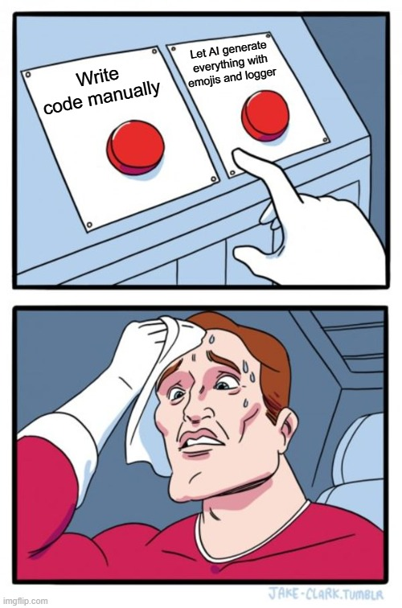

### TL;DR

- kompaktuj kontekst
- używaj mniej zaawansowanych modeli, jeśli zadanie tego nie wymaga
- czyść kontekst po zakończeniu zadania

### No to się dziś czegoś nauczyłem

Agenci AI nie są za darmo — niby człowiek o tym wiedział, ale jakoś nie czuł tego na własnej skórze. Ludzie wszędzie opisywali, ile tokenów zużyli i ile ich to kosztowało, a ja, prosty ogrodnik z pomorskiej wsi, nie rozumiałem, o co chodzi. Teraz już wiem — i wiem, ile to kosztuje.

Ostatnio postanowiłem spróbować: vibecoduję, a filmiki na YouTube kręcą się, że to takie proste. Czemu miałbym nie spróbować? W końcu coś tam kiedyś robiłem na komputerach — nie jedno "Hello World" napisałem i to nie w jednym języku (dokładnie w trzech, licząc Pascala).

### Token? Nigdy o nim nie słyszałem

Zainstalowałem GitHub Copilota i zacząłem kodować. Początki były nawet fajne: wpisujesz coś w prompt, magia się dzieje — mój nowy AI-agent zachowywał się jak junior, tylko że zamiast jednego błędu na godzinę robił ich dziesięć na minutę. Śmieszne, ale skrypt w Bash wygenerował poprawny kod w 2 minuty — mnie zajęłoby to 30 minut, bo męczyłbym się z parsowaniem JSON-a przez 25.

Po krótkim researchu zorientowałem się, że zatrudniłem sobie jakiegoś geniusza — model AI o szerokim zastosowaniu! Wybrałem jeden z rzekomo lepszych modeli, z dołu listy — co tam. Ten sam prompt i... o matko... minuta i gotowe: obsługa błędów, kolorowe emoji (moim zdaniem za dużo), dodał shebang (ja dodaję tylko, gdy muszą mnie do tego zmusić), waliduje argumenty, są gotowe moduły i biblioteki funkcji, a nawet własny logger. Kiedyś takie rzeczy powstawały na GitHubie jako projekty z kilkoma gwiazdkami — a to monstrum wygenerowało to w 67 sekund.

Oczy mi się zaświeciły — z tym narzędziem mogę stworzyć każdy software, o którym marzyłem! Po chwili pomyślałem i zacząłem programować w Javie, nadal nie wiedząc dokładnie, czym różni się klasa od interfejsu, ale mój AI wiedział. Po 10 minutach pojawił się on, psuj zabawy, niszczyciel marzeń: "Token limit exceeded".

### Poradnik Mądrości Kwantowo‑Psychologicznej (™)

Nie tak miało być — koduję poważne rzeczy. Mój pierwszy projekt "Generator bezsensownych porad życiowych" już wygenerował pierwszą poradę: „Nigdy nie ufaj człowiekowi, który kroi pizzę nożyczkami — chyba że to Ty.” Szybko sięgam po kartę kredytową i zabawa trwa dalej. Mam pomysł na dodatkowy tryb Pseudo‑Eksperta.

Generator udaje eksperta od:
- psychologii
- ekonomii
- ogrodnictwa
- fizyki kwantowej
- relacji międzyludzkich

I tworzy porady typu:

„Według fizyki kwantowej, jeśli nie patrzysz na problem, to on nie istnieje.”

To się musi udać!

Szybko dokupiłem subskrypcję u jednego z popularniejszych dostawców AI-agentów. Kosztowało to mniej niż subskrypcja Netflixa, którego nie oglądam (jakoś to, co tam pokazują, mnie nie interesuje, ale boję się anulować, bo dzieciaki kochają ich bajki — może anuluję, gdy pójdą do szkoły średniej). I koduję dalej — leci kolejny feature: profile osobowości porad.

Użytkownik wybiera styl, a generator dopasowuje ton:

- „Mentor Zen”
- „Wujek po trzecim piwie”
- „Motywacyjny coach z TikToka”
- „Sfrustrowany senior developer”
- „Elf z północy, który widział za dużo”

Vibe coding na pełnej — poziom endorfin wysoki, każdy mały rozwiązany problem uszczęśliwia. Minęło 40 minut i gdy już kończyłem implementować tryb „Porada + Uzasadnienie Naukowe”, porada była absurdalna, ale uzasadnienie brzmiało poważnie:

„Jedz lody na śniadanie. Badania z 1974 roku wykazały, że zimno poprawia szybkość podejmowania złych decyzji.”

Pojawiła się informacja, że tokeny się skończyły — wróć za 4 godziny. Co? Ja za to płacę ciężkie pieniądze — mógłbym za to kupić dwie niedopieczone pizze w jedynej pizzerii w mojej wsi i to takie z mięsem! Ale jak to tak szybko poszło? 20 minut? Okazuje się, że nawet jeśli podłączysz kartę kredytową, musisz oszczędzać.

### Na poważnie 

Kilka rzeczy warto zapamiętać: kontekst kosztuje tokeny — im więcej agent pamięta, tym więcej zasobów to zajmuje. Ten żart, który promptowałem 40 minut temu, jeśli o niego zapytam później, dalej będzie pamiętany — ale to kosztuje tokeny. Jak temu zaradzić? Po skończeniu zadania wyczyść kontekst, otwórz nowy czat albo, jeśli narzędzie to umożliwia, użyj odpowiedniej komendy. Jeśli chcesz zachować ciągłość najważniejszych zagadnień, poproś agenta, by podsumował rozmowę do pliku `nasze-gadu-gadu.md`, a następnie po utworzeniu nowego agenta przekaż mu ten plik. Tak właśnie kompaktuje się kontekst — choć ten sposób jest dość brutalny, bo może przerwać zabawę w trakcie wykonywania skomplikowanej czynności. Niektóre agenty mają wbudowaną opcję, którą można wywołać ręcznie: gdy kontekst > 70%, kompresujemy go do ~40% i z każdą iteracją wysyłamy mniej tokenów. I najważniejsze: do pisania prostych żartów nie potrzeba najbardziej wyrafinowanych modeli — wystarczą proste. Te wyrafinowane kosztują więcej, ale też mogą skuteczniej rozwiązywać złożone problemy.

- Ilu programistów potrzeba do wymiany żarówki?
- Zero. To problem sprzętowy.

Nauczyłem się czegoś: wszystko kosztuje i warto zrozumieć, czym jest waluta, którą płacimy, i za co właściwie płacimy.